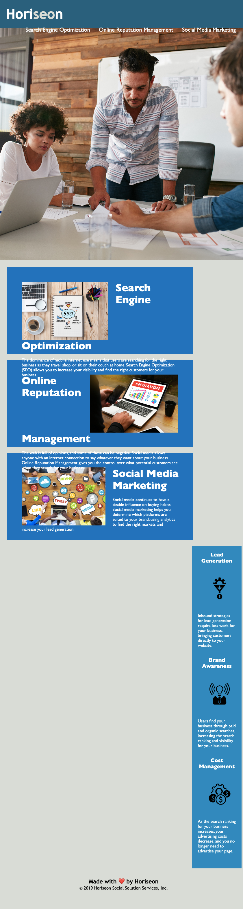

# <HoriseonChallenge>

## Description

This project was my first attempt at troubleshooting issues with the HTML and .CSS code for an existing website. I approached this exercise as a real-world example of what I could see come across my desk as a help ticket in a future career, and had an absolute blast doing it. During this challenge, I was able to find the source of a broken link on the page and restore it to working order, and took the time to go over the structure of both the HTML and .CSS files to improve the logical flow of the code, especially in the .CSS file. In an effort to improve the readability of the HTML document, I added a concise title to the code, added in alt elements to all images for identification purposes, and finished the challenge off by adding in semantic HTML elements to make the code easier to navigate and understand for future users. Through this challenge, I have learned to easily spot connections between HTML code and its corresponding .CSS, to identify spots where semantic elements could improve readability, and how important it is for code to follow logical structures to aid in troubleshooting.

https://tjmomon92.github.io/Challenge-1-11.28.2022/

## Screenshot

 

